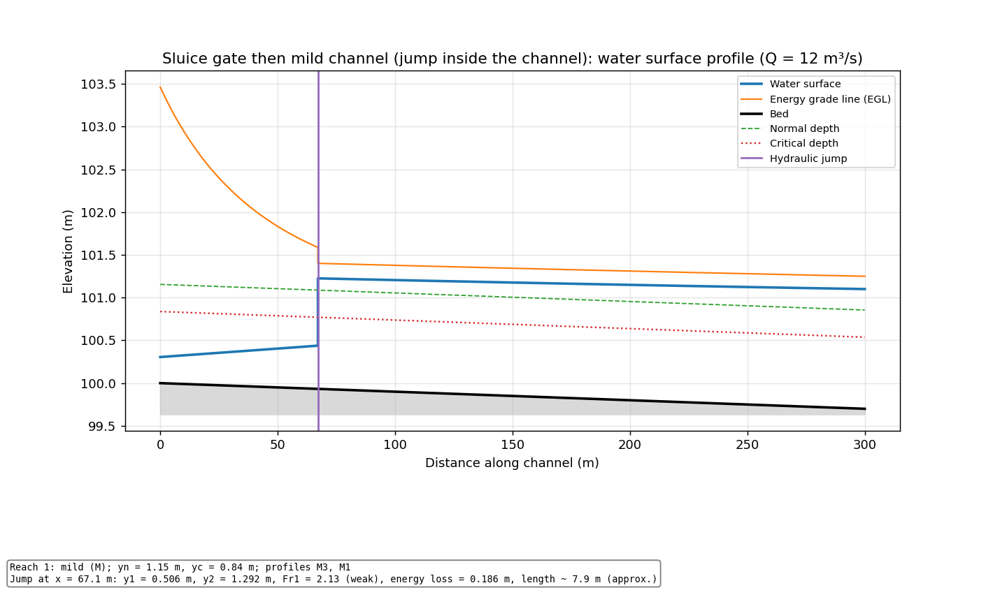

# Hydraulic Jump and Gradually Varied Flow Profiler

**Live app (runs in your browser, no install): https://biswashk920.github.io/YOUR-REPO/**



A teaching and learning tool for open-channel hydraulics. For a channel made of one or more reaches it:

* finds **normal depth** and **critical depth** for every reach,
* classifies each reach (mild, steep, critical, horizontal, adverse) and every part of the water surface profile (M1, M2, M3, S1, S2, S3, C1, C3, H2, H3, A2, A3),
* computes the **water surface profile** with the **standard step method**, across changes of slope, roughness and cross-section,
* finds where a **hydraulic jump** forms (or tells you it is drowned or swept out) and gives its sequent depth, type, energy loss and approximate length,
* plots the profile (with optional energy grade line) and the **Froude number**, and exports a CSV table.

There are two versions that use the same method and give the same answers:

| | Where | Use it for |
|---|---|---|
| Python package + command line | `gvf/` | batch runs, CSV/PNG output, tests |
| Browser app (one HTML file) | `docs/index.html` | quick exploration, dark theme, no install |

## Quick start (Windows, Anaconda Prompt)

    cd path\to\hydraulic-jump-profiler
    pip install -r requirements.txt
    python -m gvf examples/jump_gate_mild.json --egl

This prints a summary and writes `results/jump_gate_mild_stations.csv`, `..._profile.png`, `..._froude.png` and `..._summary.txt`.
Pre-computed results for every example are in `examples/results/`.

Options: `--out FOLDER`, `--Q 12`, `--step 2`, `--tol 1e-8`, `--start-z 100`, `--up ...`, `--down ...`, `--egl`, `--no-plots`.
Boundary conditions can also be given on the command line, e.g. `--up gate:0.5 --down depth:1.4`.

## Describing a channel

A JSON file (see `examples/`):

```json
{
  "name": "Sluice gate then mild channel",
  "discharge": 12.0,
  "start_bed_elevation": 100.0,
  "step": 2.0,
  "tolerance": 1e-6,
  "upstream":   {"type": "gate", "opening": 0.5, "cc": 0.61},
  "downstream": {"type": "depth", "depth": 1.4},
  "reaches": [
    {"length": 300, "slope": 0.001, "n": 0.013, "section": {"type": "rectangular", "width": 5}}
  ]
}
```

Units are SI (m, m3/s). Slope is positive when the bed falls downstream, 0 for horizontal, negative for adverse.
Sections: `rectangular` (`width`), `trapezoidal` (`width`, `side_slope` = horizontal per 1 vertical), `circular` (`diameter`).
A **CSV** file may hold the reaches table (columns `length,slope,n,section,width,side_slope,diameter`, one row per reach, see `examples/reaches_table.csv`); give Q and the boundaries with `--Q`, `--up`, `--down`.

**Boundary conditions**

| Upstream `type` | Meaning |
|---|---|
| `normal` (default) | depth of uniform flow in the first reach (only acts if that is supercritical) |
| `gate` | sluice gate: `opening` (m), optional `cc` (default 0.61); depth = cc x opening |
| `critical` | critical depth at the inlet (lake or reservoir entrance into a steep channel) |
| `depth` / `level` | known depth, or known water surface elevation |
| `none` | no condition (use for subcritical flow, or horizontal/adverse first reach) |

| Downstream `type` | Meaning |
|---|---|
| `normal` (default) | uniform flow depth in the last reach |
| `depth` / `level` | known tailwater depth, or lake/water surface elevation |
| `weir` | rectangular last reach only: `crest` height (m) and `cw` (default 1.7) in Q = cw b h^1.5 |
| `overfall` | free overfall: critical depth at the end |
| `none` | no condition (free supercritical exit) |

## How it works (short version)

1. **Controls.** Subcritical flow is controlled from downstream, so it is calculated *upstream* from the tailwater. Supercritical flow is controlled from upstream, so it is calculated *downstream* from a gate or inlet. At a break from a flatter to a steeper reach (for example mild to steep) the flow passes through critical depth, so critical depth becomes a control at the break.
2. **Standard step.** From a known depth, the depth at the next station is found by solving the energy equation `z1 + y1 + V1^2/2g = z2 + y2 + V2^2/2g + Sf_avg * dx` with `scipy.optimize.brentq` (a root-finder that always converges once the root is bracketed) on the correct side of critical depth. Friction slope comes from Manning's equation, averaged over the step. If no solution exists at the chosen step, the step is split into smaller sub-steps; if that fails too, the profile has reached critical depth and a warning is shown.
3. **Reach junctions.** The bed is continuous and energy is conserved across the junction, so a change of section changes the depth there; slope and roughness changes simply continue the profile.
4. **Finding the jump.** The supercritical profile (from the upstream control) and the subcritical profile (from the tailwater) are both computed. Going downstream, the jump is where the momentum function `M = Q^2/(gA) + A*ybar` of the supercritical flow falls to that of the subcritical flow. The position is refined between stations. The depth after the jump is the sequent depth, solved from `M(y2) = M(y1)` for any section.
   * **Drowned jump:** the tailwater already exceeds the sequent depth at the supercritical start, so the jump is pushed up to the gate.
   * **Swept-out jump:** the tailwater is below the sequent depth all the way, so flow stays supercritical to the end.
5. **Jump properties.** Type by upstream Froude number Fr1: undular (< 1.7), weak (1.7-2.5), oscillating (2.5-4.5), steady (4.5-9), strong (> 9). Energy loss is E1 - E2 from specific energy. **Jump length uses L = 6.1 y2, an approximate empirical rule of thumb** (a "6 times y2" rule is commonly quoted for Fr1 above about 4.5). It was written from memory, not copied from a specific source: check it against your textbook before relying on it.

## What is verified, and what is not

`python -m unittest discover -s tests -v` (or `pytest`) runs 26 tests.

**Verified analytically (each has a test):**

* normal depth round trip (Q recomputed from the depth found) for rectangular, trapezoidal, triangular and circular sections;
* critical depth equals (q^2/g)^(1/3) for rectangles, and Fr = 1 at critical depth for every section type;
* sequent depth `y2/y1 = 0.5(sqrt(1+8 Fr1^2) - 1)` and energy loss `(y2-y1)^3/(4 y1 y2)` for rectangles;
* equal momentum function on both sides of every computed jump (rectangular and circular);
* far from any control the profile approaches Manning's normal depth (M1, M2 and S2);
* standard step profile compared with the **direct step method** on a prismatic channel (agreement about 2e-4 m);
* energy equation residual, continuity and non-rising energy line along the profile (continuity is trivial in steady 1D flow, listed for completeness);
* profile classification for each slope type: M1, M2, M3, S1, S2, S3, C1, C3, H2, H3, A2, A3;
* critical depth control at a mild-to-steep break; drowned and swept-out jumps; jump moving downstream when the tailwater drops;
* friendly error messages for bad input;
* the browser version gives the same depths, Froude numbers and jump results as Python on all 9 examples (differences below 1e-12 m).

**Textbook-style but NOT verified against published data:** the jump classes by Fr1, the jump length rule, the weir coefficient default (1.7), the 0.61 gate contraction coefficient, and the free-overfall simplification (critical depth at the last station; the real brink depth is lower). **No published numerical example is used anywhere.** See `examples/TEXTBOOK_EXAMPLE.md` for how to compare with Chow or Chaudhry and what to look for.

**What was not tested:** the browser page was loaded in a headless Chromium browser and ran without errors, but only on desktop and a phone-sized window, and I did not test it on Safari, Firefox or real phones.

## Limitations

Steady, gradually varied, one-dimensional flow only. Prismatic reaches (one section per reach). No sediment, no side inflow, no local losses at junctions (no choking or constriction control at section changes). A jump on a sloping bed uses the horizontal-floor momentum equation. Jump length is empirical. Circular pipes are limited to 99 % of the diameter (no pressurised flow). Critical-slope reaches are treated like steep reaches for control purposes. Near Fr = 1 the method is sensitive and the program warns.


## Layout

    README.md  LICENSE  .gitignore  requirements.txt
    gvf/        Python package (sections, hydraulics, step, profile, jump, checks, io, plots, cli)
    docs/       index.html, the single-file browser version (GitHub Pages)
    examples/   example channels (.json, .csv), results/ and the textbook comparison slot
    tests/      unit tests (Python) and the Node runner that tests the browser logic

## License

MIT, see `LICENSE`.